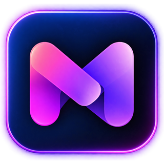

<div align="center">

<br>



<h1>Movviz</h1>
<p><strong>Ton catalogue. Ton serveur. Tes règles.</strong></p>

<p>
Movviz réunit en <strong>une seule application auto-hébergée</strong> tout ce qu'il faut pour vivre ses films et séries :
découverte, recherche, téléchargement intégré, bibliothèque, lecture, suivi de ce que tu regardes,
recommandations personnelles, assistant IA à qui l'on parle à la voix, et des applications natives pour la TV et le téléphone —
le tout synchronisé en temps réel entre tous tes écrans.
</p>

<a href="https://github.com/dj41ph4/movviz/releases/latest">
  
</a>
<a href="https://hub.docker.com/r/dj41ph4/movviz">
  
</a>
<a href="https://github.com/dj41ph4/movviz/releases/latest">
  
</a>
<a href="android-tv-nx/">
  
</a>
<a href="android-mobile-nx/">
  
</a>

<br><br>


</div>

<br>

---

## Sommaire

- [Pourquoi Movviz](#pourquoi-movviz)
- [Movviz en un coup d'œil](#movviz-en-un-coup-dœil)
- [Installation](#installation)
- [Premier démarrage](#premier-démarrage)
- [Fonctionnalités en détail](#fonctionnalités-en-détail)
  - [1. Accueil et tableau de bord](#1-accueil-et-tableau-de-bord)
  - [2. Découverte](#2-découverte)
  - [3. Fiche d'un film ou d'une série](#3-fiche-dun-film-ou-dune-série)
  - [4. Acteurs et réalisateurs](#4-acteurs-et-réalisateurs)
  - [5. Recherche](#5-recherche)
  - [6. Bibliothèque](#6-bibliothèque)
  - [7. Collections et sagas](#7-collections-et-sagas)
  - [8. Téléchargement intégré](#8-téléchargement-intégré)
  - [9. Qualité, remplacements et automatisation](#9-qualité-remplacements-et-automatisation)
  - [10. Lecture : le lecteur Movviz](#10-lecture--le-lecteur-movviz)
  - [11. « Vu », reprises et historique](#11--vu--reprises-et-historique)
  - [12. Recommandations personnelles](#12-recommandations-personnelles)
  - [13. Movviz AI, l'assistant](#13-movviz-ai-lassistant)
  - [14. Temps réel entre tous tes écrans](#14-temps-réel-entre-tous-tes-écrans)
  - [15. Multi-utilisateurs, demandes et profils](#15-multi-utilisateurs-demandes-et-profils)
  - [16. Plex (facultatif)](#16-plex-facultatif)
  - [17. Imports : Netflix, Trakt, IMDb, Letterboxd, Seerr](#17-imports--netflix-trakt-imdb-letterboxd-seerr)
  - [18. Notifications](#18-notifications)
  - [19. Application Android TV](#19-application-android-tv)
  - [20. Application Android mobile](#20-application-android-mobile)
  - [21. Disque, fichiers et maintenance](#21-disque-fichiers-et-maintenance)
  - [22. Serveur, diagnostic et performance](#22-serveur-diagnostic-et-performance)
  - [23. Interface et expérience](#23-interface-et-expérience)
  - [24. Données, sécurité et fiabilité](#24-données-sécurité-et-fiabilité)
- [Les tâches automatiques](#les-tâches-automatiques)
- [Architecture technique](#architecture-technique)
- [Développement](#développement)
- [Guides](#guides)
- [Soutenir le projet](#soutenir-le-projet)

---

## Pourquoi Movviz

Les outils du genre existent depuis longtemps, chacun sur un bout du problème : un site pour découvrir, un outil pour chercher les releases, un client torrent pour télécharger, un gestionnaire pour organiser, un serveur pour regarder, une app pour les demandes de la famille… Movviz part d'un principe simple : **tout ça devrait vivre au même endroit**, avec une seule base, une seule interface et un niveau de finition qui donne envie de l'ouvrir.

Concrètement :

- **Un vrai moteur de recherche** sur tes indexeurs Torznab/Newznab et **un client BitTorrent intégré** : aucun outil tiers à installer pour télécharger.
- **Une bibliothèque qui se tient à jour toute seule** : recherche des manquants, sorties du jour, flux RSS, remplacement par une meilleure qualité, réparation des fichiers déplacés.
- **Un lecteur intégré** qui lit directement quand c'est possible, et sinon remuxe ou transcode avec l'accélération matérielle du serveur, HDR compris.
- **Un suivi « vu » et des reprises unifiés**, par profil, synchronisés en temps réel entre le PC, la TV et le téléphone.
- **Des recommandations qui te connaissent** : ce que tu as vu, noté, aimé ou rejeté, tes acteurs et réalisateurs préférés.
- **Un assistant IA** qui comprend le langage naturel, conseille, ajoute, lance un film et discute à la voix.
- **Des applications Android natives** pour la TV et le téléphone, pas des pages web redimensionnées.
- **Plex en option** : Movviz s'y connecte et se synchronise avec lui, mais fonctionne sans.

Rien de tout ça n'est un service externe : c'est ton serveur, tes fichiers, tes comptes. Movviz orchestre.

---

## Movviz en un coup d'œil

| Domaine | Ce que Movviz fait |
| --- | --- |
| **Découvrir** | Tendances, nouveautés par plateforme (Netflix, Disney+, Prime Video…), genres, studios, chaînes, classements, bandes-annonces, filtres par continent |
| **Trouver** | Recherche unifiée dans tous les indexeurs, notation des releases selon tes règles, recherche interactive, résolveur Cloudflare |
| **Télécharger** | Moteur BitTorrent intégré (une instance films, une instance séries), import et renommage automatiques, reprise des téléchargements orphelins |
| **Organiser** | Bibliothèque films/séries, épisodes manquants, calendrier, sagas, collections, versions multiples d'un film, corbeille, titres interdits |
| **Regarder** | Lecteur Movviz (direct, remux ou transcodage GPU/CPU, HDR→SDR), passer l'intro et le générique, épisode suivant, reprise exacte |
| **Suivre** | « Vu » par profil, reprises unifiées, import de l'historique Netflix et Plex, synchronisation temps réel entre appareils |
| **Être conseillé** | Suggestions personnelles expliquées, « À revoir sans modération », « Moins de 40 minutes », assistant IA avec recherche web |
| **Partager** | Multi-utilisateurs, profils, demandes avec quotas et approbation, import Seerr, listes Trakt/IMDb/Letterboxd, watchlist Plex |
| **Être prévenu** | Discord, Telegram, Gotify, Slack, Pushbullet, webhook, centre de notifications |
| **Surveiller** | Voyants de santé, Doctor, benchmark de transcodage, temps de réponse, profil CPU du serveur, journaux, 25 tâches planifiées |
| **Emporter** | Android TV (télécommande, chaînes Google TV) et Android mobile (portrait, paysage, écran pliable, IA vocale) |

---

## Installation

<table>
<tr>
<td width="25%" align="center" valign="top">

### Windows

**`Movviz-Setup-X.Y.Z.exe`** sur la page des releases

<a href="https://github.com/dj41ph4/movviz/releases/latest">
  
</a>

Service Windows installé et démarré au boot · installeur multilingue · **mise à jour en un clic** depuis Réglages, ou **automatique** dès qu'une version sort

</td>
<td width="25%" align="center" valign="top">

### Linux

```bash
tar -xzf movviz-linux-x64.tar.gz
cd movviz && sudo ./packaging/linux/install.sh
```

Bundle précompilé x64 et ARM64 · service systemd · mise à jour sans perte de données · désinstallation propre (`uninstall.sh`)

</td>
<td width="25%" align="center" valign="top">

### Docker / NAS

```bash
docker pull dj41ph4/movviz:latest
```

Images amd64 et arm64 · `docker-compose.yml` fourni dans `packaging/docker` · adapté aux NAS (Synology…) avec re-pull automatique possible

</td>
<td width="25%" align="center" valign="top">

### Android

**`Movviz-NX-Android-TV-client.apk`** et **`Movviz-NX-Mobile-client.apk`** sur la page des releases

Les applications se **mettent à jour toutes seules** depuis GitHub

</td>
</tr>
</table>

**Ports par défaut** : interface web `9810`, moteur BitTorrent `9820`, résolveur Cloudflare `9830`, pair-à-pair `55000`/`55001`.

> Le micro de l'assistant vocal (dans le navigateur) exige une adresse **https** ou `localhost` : c'est une règle des navigateurs. Derrière un reverse proxy https, tout fonctionne ; en http sur le réseau local, la lecture à voix haute marche mais pas la dictée.

---

## Premier démarrage

À la première ouverture, **l'assistant de configuration** (`/setup`) te guide pas à pas — chaque étape peut être passée et reprise plus tard :

1. **Compte administrateur** — le seul obligatoire. Les comptes créés ensuite (inscription ou Plex) devront être approuvés.
2. **Langue** — français, anglais, allemand, italien, néerlandais ; modifiable à tout moment sans redémarrer.
3. **Matériel principal** — TV récente, smartphone, PC, NAS au stockage limité ou serveur dédié : Movviz en déduit un point de départ pour la qualité (HEVC/HDR/10 bits pour une TV, fichiers légers AV1/HEVC pour un téléphone ou un NAS, aucune limite de taille pour un serveur…). Rien n'est figé.
4. **Personnalisation** — tes appareils (TV 4K, smartphone, tablette, PC, console, serveur distant) et ton style d'accueil.
5. **Clé TMDb** — une clé intégrée fonctionne tout de suite ; tu peux utiliser la tienne.
6. **Clé TVDB** (facultative) — meilleure numérotation et titres des épisodes d'anime.
7. **Assistant IA** (facultatif).
8. **Indexeurs** — au moins un pour que Movviz cherche tout seul.
9. **Téléchargement** — dossiers de téléchargement et de destination, films et séries séparés ; **recherche automatique des manquants** activée par défaut.
10. **Plex** (facultatif) — synchronisation de la bibliothèque et des comptes de la famille.

Plus tard, **Réglages → Version** permet de relancer l'assistant en **configuration complète** ou en **optimisation intelligente**, qui ne retouche que ce que l'assistant avait réglé lui-même, jamais ce que tu as modifié à la main.

---

## Fonctionnalités en détail

### 1. Accueil et tableau de bord

L'accueil est pensé comme celui d'une plateforme de streaming, mais nourri par **ta** bibliothèque et **tes** goûts.

- **Trois ambiances**, propres à chaque utilisateur :
  - **Cinéma** : grand hero immersif avec bandes-annonces et carrousels personnalisés ;
  - **Classique** : même chose sans le grand hero ;
  - **Compact** : sans la file de téléchargement.
- **Hero cinématique** : diaporama (vitesse réglable), bande-annonce en lecture automatique ou désactivée, logo officiel du titre, mélange au choix de titres déjà possédés et de titres à découvrir. Le bouton **« Pourquoi ce contenu ? »** explique chaque proposition : même genre que tes favoris, réalisateur que tu suis, acteur que tu apprécies, déjà disponible, très bien noté, sortie récente, langue d'origine…
- **Rangées** :
  - **Reprendre** : là où tu t'étais arrêté, films et épisodes, avec le temps restant et un menu pour retirer un titre de la liste ;
  - **Épisodes récemment ajoutés** : l'épisode précis qui vient d'arriver, pas seulement la série ;
  - **Suggestions adaptées** ;
  - **À revoir sans modération** : ce que tu as déjà vu et qui est encore lisible ;
  - **Vous avez peu de temps ? Moins de 40 minutes** ;
  - **Vos prochaines sorties** et **Tendances Movviz** ;
  - carrousels de découverte, avec une **année minimale** réglable pour écarter les très vieux titres.
- **Tuiles de statistiques** réorganisables par glisser-déposer : films, séries, épisodes suivis, disponibles ou manquants, en téléchargement, en recherche, demandes en attente.
- **File de téléchargement** et **activité en direct**, avec « Dans le pipeline » (titres surveillés, recherchés et en cours).
- **Fenêtre « Nouveautés »** après une mise à jour, avec les notes de version complètes.

### 2. Découverte

- **Films / Séries** avec des rangées dynamiques :
  - tendances, populaires, mieux notés, à venir, au cinéma ou en cours de diffusion ;
  - box-office, enfants, nouvelles sorties, nouvelles séries et séries renouvelées.
- **Plateformes de streaming** : nouveautés et suggestions **séparées par plateforme** (Netflix, Disney+, Prime Video, Apple TV+, Max, Crunchyroll, OCS…), avec leurs logos officiels.
- **Genres, studios, chaînes**, classements numérotés, grille infinie avec filtres (genre, année, tri) et **pastilles de filtres actifs**.
- **Découverte par continent** : chacun choisit les régions du monde qu'il veut voir en priorité.
- **Deux agencements** : Movviz (carrousels d'affiches et classements) ou **Allociné**.
- **Calendrier VF des animes** : dates de sortie des versions françaises.
- **« Je n'aime pas »** : un titre rejeté ne revient pas, même après actualisation, et nourrit tes recommandations.
- **Ajout en un clic** depuis n'importe quelle carte : Movviz ajoute le titre et part chercher une release.

### 3. Fiche d'un film ou d'une série

- **Hero animé** : la bande-annonce joue en fond. Les sources sont TMDb, une recherche YouTube dans ta langue si TMDb n'en a pas (facultatif) et, en option, une vidéo directe Apple TV ou IMDb avant YouTube. Les bandes-annonces verticales sont écartées automatiquement.
- **Notes** TMDb, IMDb, Rotten Tomatoes et Metacritic (via OMDb), durée, saisons, genres, slogan, synopsis, budget et recettes.
- **Où le regarder** : les plateformes qui le proposent en abonnement.
- **Actions** :
  - **Lire / Reprendre à HH:MM:SS / Depuis le début** ;
  - **Ajouter à la bibliothèque** ou demander le titre ;
  - **Rechercher**, **Choix manuel** d'une release ;
  - **Ma liste** ;
  - **Vu / non vu**, pour le titre, une saison entière ou un épisode ;
  - **Signaler un problème** ;
  - **Ouvrir dans Plex**.
- **Séries** : cartes de saisons, liste des épisodes (vignette, résumé, date de diffusion, statut, coche « vu », progression du téléchargement par épisode), **Télécharger la saison**, épisodes spéciaux (saison 0) suivis mais non surveillés par défaut.
- **Films** : **gestion des versions** — ajouter une autre qualité sans remplacer l'existante, comparer, choisir la principale, supprimer.
- **Modifier la fiche** (admin) : suivi, profil de qualité, emplacement du fichier, **autres noms** (titres alternatifs pour fiabiliser la recherche), **choix des visuels** (affiche, fond, logo).
- **Distribution et équipe**, mots-clés, **titres similaires**, saga, liens externes (Plex, TMDb, IMDb, Rotten Tomatoes, Letterboxd).
- **Informations techniques** du fichier : résolution, codecs vidéo et audio, HDR, taille.
- La fiche s'ouvre **en panneau glissant** depuis les listes, sans quitter la page.

### 4. Acteurs et réalisateurs

- **Filmographie complète**, films et séries mêlés, triée utilement.
- Ce que tu **as déjà** et ce qui **te manque** d'un acteur ou d'un réalisateur, comparé à ta bibliothèque.

### 5. Recherche

- **Recherche rapide** (Ctrl+K / Cmd+K) : films, séries, **acteurs et réalisateurs**, résultats en cartes.
- **Recherche dans les indexeurs** (`/search`) :
  - tous tes indexeurs Torznab/Newznab en une requête, films et séries mêlés ou filtrés ;
  - **score de qualité** de chaque release selon tes règles, avec l'âge, la taille et les seeders ;
  - bouton **Récupérer**, et releases récentes affichées quand le champ est vide.
- **Diagnostic par indexeur** : pourquoi un indexeur n'a rien renvoyé (clé, limite de débit, catégorie…), et un **journal de chaque requête** envoyée.
- **Catégories personnalisées** d'indexeur prises en compte, bouton pour **actualiser les catégories**, recherche complète sur **C411**.
- **Résolveur Cloudflare** intégré pour les indexeurs protégés.

### 6. Bibliothèque

- **Films et Séries** comme de vrais hubs, façon Plex : filtres (type, statut, étiquette), tris (titre, récemment ajouté…), grille progressive qui reste fluide avec des milliers de titres.
- Onglet **Collection**, **Calendrier** des sorties et diffusions (VF/VO), **Recherchés** : tout ce qui manque, avec « Tout télécharger » ou une recherche par élément.
- **Statuts** : disponible, en téléchargement, recherche en cours, manquant, à venir.
- **Réconciliation** avec le disque : fichiers disparus ou non suivis signalés, sans jamais rien supprimer en cas de stockage momentanément indisponible.
- **Corbeille** : les fichiers supprimés y vont d'abord, avec une durée de conservation réglable.
- **Titres interdits** (jamais redemandés ni ajoutés), **exclusions**, **torrents bloqués**.

### 7. Collections et sagas

- **Sagas TMDb** détectées automatiquement (Star Wars, Harry Potter…) avec la progression possédés/total, et ce qui manque.
- **Collections personnalisées** pour organiser ta bibliothèque comme tu veux, en grande grille, petite grille ou liste.

### 8. Téléchargement intégré

- **Moteur BitTorrent intégré**, dans un processus séparé :
  - **une instance pour les films, une pour les séries**, chacune avec ses dossiers, ses limites de vitesse, son ratio de seed, ses pairs et ses slots d'envoi ;
  - deux moteurs au choix : **stable** (JavaScript) ou **natif**, en bêta, très léger (quelques Mo de mémoire, des centaines de torrents).
- **File de téléchargement** : progression, vitesse, temps restant, pause/reprise, redémarrage, retrait (avec ou sans les fichiers), ajout manuel par **lien magnet** ou **fichier .torrent**, jaquettes et titres cliquables.
- **Import automatique** : à la fin du téléchargement, le fichier est déplacé et **renommé selon ton modèle**, la fiche passe à « Lire ». Un épisode re-téléchargé **remplace** l'ancien fichier au lieu de s'installer à côté.
- **Récupération des téléchargements orphelins** : un téléchargement terminé dont l'import n'a jamais eu lieu est retrouvé et importé automatiquement, avec des garde-fous (jamais un fichier déjà en place réimporté, jamais une série à la place d'un film).
- **Historique** : récupéré, importé, mis à jour, échoué, bloqué ; onglets **Erreurs** et **Non liés** (un fichier importé sans titre associé se rattache en un clic).

### 9. Qualité, remplacements et automatisation

- **Règles de qualité** entièrement réglables, rien n'est imposé :
  - **mots interdits** ;
  - **tailles maximales** par film, épisode ou saison ;
  - **points par codec** (x264, x265, AV1) ;
  - **formats personnalisés** (expressions régulières, avec score positif ou négatif) ;
  - **politique de taille** (plus petit, équilibré, meilleure qualité) qui tient compte de l'efficacité réelle du codec.
- **Profils de qualité** par titre, et profil de départ selon ton matériel.
- **Mises à niveau automatiques** : dès qu'une meilleure version apparaît, Movviz la récupère et remplace l'ancienne.
- **Rechercher et remplacer** : suggestions de remplacement expliquées, par exemple langue cible, meilleur codec ou fichier plus léger à qualité égale.
- **Recherche des sorties du jour**, **relance des films manquants**, **scan RSS** des indexeurs.
- **Anime** :
  - épisodes spéciaux ;
  - numérotation et titres via TVDB ;
  - **autres noms** pour les titres romanisés ;
  - calendrier VF.
- **Journal des décisions** : pourquoi une release a été prise ou refusée (dans le Doctor).

### 10. Lecture : le lecteur Movviz

Un **moteur de lecture unifié** choisit automatiquement l'opération minimale nécessaire pour lire un média sur l'appareil qui le demande :

- **Lecture directe** quand l'appareil sait décoder le fichier.
- **Remux** (vidéo copiée telle quelle) avec **audio adapté** quand seul le conteneur ou l'audio pose problème.
- **Transcodage** seulement si nécessaire, avec **encodeur matériel vérifié** (GPU) ou logiciel, et **conversion HDR/Dolby Vision → SDR** (désactivable entièrement).
- Chaque fichier est **analysé une fois** (ffprobe : codecs, HDR, pistes audio et sous-titres exactes) et le résultat est gardé : les décisions suivantes sont instantanées.
- **Pistes audio** avec langue préférée, **sous-titres**, **vitesse**, **Picture in Picture**, volume, plein écran.
- **Reprendre** exactement où tu t'étais arrêté, ou **depuis le début**.
- **Passer l'intro** et **passer le générique**, aux horaires fournis par Plex. En fin d'épisode, le bouton devient **Épisode suivant**, avec un repli sur les dernières secondes quand aucun générique n'est connu.
- Un épisode quitté **au-delà de 80 %** ou passé au suivant ne reste pas dans « Reprendre ».
- **Cache de segments** et réserve de lecture réglables, **mode diagnostic** qui affiche chaque décision (codec, copie/transcodage, buffer).
- **Sessions actives** : qui regarde quoi, sur quel appareil (navigateur, Android, Android TV), en direct, en remux ou en transcodage, via le lecteur Movviz ou via Plex.
- Fonctionne **sans Plex** pour les fichiers de ta bibliothèque. Plex reste une option de lecture.

### 11. « Vu », reprises et historique

- **Une seule source de vérité** pour « vu / non vu » et les reprises, **par profil** : ce que regarde l'un ne se mélange jamais à ce que regarde l'autre.
- Marquer vu **un épisode, une saison ou une série entière**. Le bouton répond **instantanément** sur tous les appareils : l'écran change tout de suite et l'enregistrement se fait en arrière-plan.
- Marquer vu un titre en cours **efface son avancement** et le retire de « Reprendre », même avant que Plex ne suive.
- **Reprises unifiées** : lecteur Movviz et Plex réunis dans une seule rangée « Reprendre », avec une seule reprise active par série.
- **Historique Plex** importé par profil (y compris les anciens profils Home), sans jamais écraser une vue plus récente.
- **Import de l'historique Netflix** (voir [Imports](#17-imports--netflix-trakt-imdb-letterboxd-seerr)).
- La progression d'une lecture en cours survit aux redémarrages du serveur (mises à jour comprises).

### 12. Recommandations personnelles

Le moteur de recommandations **« Pour vous »** s'appuie sur tout ce que Movviz sait de toi :

- ce que tu as **vu**, **noté** (étoiles), **aimé ou rejeté** (pouce haut/bas, « pas pour moi »), **demandé**, ajouté à **ta liste** ;
- ton **profil de goûts calculé** : genres, **acteurs et réalisateurs favoris**, ambiances, en évitant qu'un seul acteur envahisse la sélection ;
- la **cohérence entre plusieurs titres aimés**, plutôt que la simple popularité ;
- ce que tu as **déjà vu** ou qu'on t'a **déjà proposé**, qui ne revient pas ;
- les documentaires et making-of sont écartés, sauf si tu les cherches.

Résultats :

- **Suggestions adaptées**, **À revoir sans modération**, **Moins de 40 minutes** ;
- le hero de l'accueil, avec l'explication de chaque choix ;
- les titres similaires sur chaque fiche ;
- les mêmes recommandations sur Android TV et mobile.

### 13. Movviz AI, l'assistant

Une bulle de discussion présente sur le web et sur Android mobile, qui comprend le **langage naturel** :

- **Conseiller** selon tes goûts réels : « un film d'horreur pour débutant », « une série courte et drôle », « comme X mais sans Y ». Les propositions arrivent sous forme de **cartes** : pourquoi ce titre te plaira, distance à tes goûts habituels, note.
- Sur chaque carte :
  - **Ajouter** à la bibliothèque (téléchargement automatique) ;
  - **Ma liste** ;
  - **Déjà vu** et **Pas pour moi**, qui remplacent aussitôt la carte par une autre ;
  - **J'aime**.
- **Agir** au lieu de demander :
  - « lance Silent Night » démarre le titre ;
  - « lance-le » lance celui dont vous parlez ;
  - « lance un film d'action au hasard » choisit un film non vu de ta bibliothèque et le lance ;
  - « mets-le en vu », « je mets 4/5 à X ».
- **Répondre** sur ta bibliothèque et le cinéma :
  - « je l'ai ? », « je l'ai vu ? », « qui joue dedans ? », « la série est terminée ? » ;
  - « qu'est-ce qui me manque de cette saga / de ce réalisateur ? » ;
  - la **musique** d'une scène, les **scènes cultes**, via une **vraie recherche web** (Tavily) résumée par l'IA.
- **Se souvenir de toi** d'une conversation à l'autre : prénom, goûts, rejets, avec un profil de goûts propre à chaque utilisateur.
- **Garde le fil** : « le deuxième », « celui-là » ou « pourquoi celui-ci ? » renvoient aux titres qu'il vient de proposer.
- **Comprend malgré les fautes de frappe** : « apelle moi », « deja vu », « recomande », « episdoe ».
- **Une personnalité** :
  - humour, anecdotes, emojis avec mesure ;
  - il **ne se soumet à personne** : il refuse « maître » avec panache, sans phrase toute faite ;
  - il **ne se laisse pas écraser** face aux insultes, sans jamais attaquer gratuitement.
- **Réponses rapides** : des boutons adaptés à la question qu'il vient de poser.
- **À la voix** (activable par l'admin) :
  - **dictée au micro** et **lecture des réponses à voix haute** avec les voix de l'appareil, les plus naturelles en premier, au choix ;
  - **mode conversation** sans les mains.
- **Fournisseur** : Gemini (offre gratuite), avec **plusieurs clés utilisées à tour de rôle** et **bascule automatique** vers un autre modèle Gemini quand l'un est saturé ou hors quota. Plusieurs personnes peuvent lui parler en même temps.
- **Pour l'admin** : clés et modèles gratuits vérifiés dans Réglages → Assistant IA, bouton **Tester**, **journal de débogage** de chaque échange (durée, fournisseur, erreur).
- Désactivé par défaut. Les clés ne quittent jamais le serveur.

### 14. Temps réel entre tous tes écrans

Movviz ne rafraîchit rien pour rien : **quand quelque chose change, le serveur prévient les appareils concernés**, qui se mettent à jour à l'instant.

- Marquer vu, avancer une lecture, retirer un titre de « Reprendre » ou modifier « Ma liste » sur le PC se voit aussitôt sur la TV et le téléphone, et inversement. Seuls les appareils du même utilisateur sont prévenus.
- Un téléchargement qui démarre, avance ou se termine s'affiche en direct, y compris ceux lancés automatiquement. Quand il se termine, la fiche ouverte passe à **« Lire »** et l'épisode apparaît dans **« Épisodes récemment ajoutés »**.
- Au retour dans une application, ou après une coupure réseau ou un redémarrage du serveur, une seule relecture rattrape ce qui a changé.
- Aucun appareil connecté : aucune surveillance ne tourne. Tout fonctionne **Plex éteint**.

### 15. Multi-utilisateurs, demandes et profils

- **Comptes locaux** ou **connexion avec Plex**. Les nouvelles inscriptions attendent l'approbation d'un admin.
- **Rôles** (utilisateur / admin), **gestion des demandes déléguée** à un non-admin, **approbation automatique** par utilisateur.
- **Demandes** : chacun demande un film ou une série, avec des **quotas** par utilisateur. L'admin approuve ou refuse, et la recherche démarre toute seule. Le statut suit la vraie bibliothèque (recherche, téléchargement, disponible).
- **Problèmes signalés** (vidéo, audio, sous-titres, autre) avec fil de commentaires, résolution et réouverture.
- **Profils** avec **photo de profil** synchronisée sur le web, la TV et le mobile, et **choix du profil au démarrage** des applications.
- **Ma liste** (watchlist) personnelle, aussi pour des épisodes.
- **Import des utilisateurs Plex**, amis et profils partagés compris.
- **Suppression de compte** propre : sessions fermées, conversation IA effacée, dernier admin protégé.
- **Jetons d'API** personnels : création, dernière utilisation, révocation.

### 16. Plex (facultatif)

Movviz **fonctionne sans Plex**. Connecté, il en tire le meilleur :

- **Connexion** par nom d'hôte ou IP, port, SSL, avec une authentification Plex en un clic, et des **correspondances de chemins** entre Plex et Movviz (Docker, NAS).
- **Synchronisation de la bibliothèque** incrémentale, toutes les 5 minutes, sans doublons, ou complète à la demande.
- **Synchronisation des vues** dans les deux sens, **par profil** : administrateur, profils Home, amis et utilisateurs partagés, chacun avec son propre historique, jamais celui du compte propriétaire.
- **Intros et génériques** récupérés pour « Passer l'intro / le générique ».
- **Watchlist Plex** importée, sans que ça déclenche de téléchargement.
- **Reprises Plex** fusionnées avec celles du lecteur Movviz.
- **Moniteur des sessions** Plex en direct.
- Journal et diagnostic de chaque synchronisation, et réconciliation complète en arrière-plan.

### 17. Imports : Netflix, Trakt, IMDb, Letterboxd, Seerr

- **Netflix** : télécharge ton historique depuis ton compte Netflix (CSV) et dépose-le. Films et épisodes reconnus sont marqués vus, dans Movviz et sur Plex s'il est lié, avec la liste des titres non reconnus.
- **Listes Trakt, IMDb, Letterboxd** : synchronisées automatiquement dans la bibliothèque, avec ou sans approbation.
- **Seerr / Overseerr** : import des demandes existantes, avec le rapport complet (importées, déjà présentes, refusées, utilisateurs non trouvés), puis synchronisation régulière.

### 18. Notifications

- **Discord, Telegram, Gotify, Slack, Pushbullet**, et un **webhook** HTTP vers l'adresse de ton choix, chacun avec un bouton **Tester**.
- Événements : titre disponible, récupéré, importé, échec, demande, téléchargements récupérés…
- **Centre de notifications** dans l'interface, mis à jour en direct.

### 19. Application Android TV

Une application native **Kotlin + Jetpack Compose for TV**, pensée pour la télécommande, avec un shell façon Netflix :

- **Barre latérale** avec photo de profil, **accueil** avec hero immersif, bande-annonce plein écran, logos officiels, « Reprendre » avec le temps restant, épisodes récents, suggestions personnelles.
- **Films et Séries** en vrais hubs, **Découverte** séparée du catalogue, **recherche**, **téléchargements**, **profil**.
- **Fiches** complètes :
  - saisons en grille et fiche épisode façon Plex ;
  - bouton « Vu » instantané ;
  - bandes-annonces ;
  - ajout et téléchargement directement depuis la TV.
- **Lecteur** :
  - lecture directe ou transcodée, pistes audio et sous-titres, avance rapide groupée ;
  - **passer l'intro / le générique en un seul OK** ;
  - **bouton Épisode suivant** ;
  - heure sur la barre, reprise exacte.
- **Navigation D-pad** fiabilisée sur chaque écran : focus stable, aucun piège.
- **Chaînes Google TV** : Movviz sur l'écran d'accueil du téléviseur.
- **Accueil local-first** : l'écran s'affiche immédiatement depuis la dernière session, puis se met à jour.
- **Temps réel**, **plus aucune requête en arrière-plan** quand l'application n'est pas affichée, **mise à jour automatique** depuis GitHub.

### 20. Application Android mobile

Le même univers sur le téléphone, avec **trois mises en page dédiées** : portrait, paysage et écran déplié.

- **Accueil centré sur les reprises**, suggestions, épisodes récents ; **bibliothèque** en trois colonnes en portrait ; Découverte, recherche, téléchargements, fiches acteurs, profil.
- **Fiches** : épisodes lisibles en portrait, bouton « Vu » instantané, ajout en un tap.
- **Fiches instantanées** : une fiche déjà ouverte réapparaît immédiatement, saisons comprises, puis se met à jour.
- **Lecteur natif** : reprise, épisode suivant, passer l'intro et le générique.
- **Movviz AI** : la même discussion que sur le web (cartes, actions, « lance-le » qui ouvre le lecteur, dictée et voix de synthèse du téléphone au choix).
- **Retour haptique** sur tous les boutons, **temps réel**, **mise à jour automatique**.

### 21. Disque, fichiers et maintenance

- **Indexation** : retrouve les fichiers déjà présents sur le disque et les rattache à la bibliothèque, avec une recherche TMDb intégrée pour les cas ambigus.
- **Renommage en masse** selon le modèle : analyse, sélection, aperçu, exécution avec journal en direct.
- **Modèles de nommage** avec jetons (`{title}`, `{year}`, `{quality}`, `{season:00}`…), points ou espaces, et un aperçu en direct.
- **Réparer les chemins** : fichiers déplacés retrouvés (correspondances certaines, ambiguës ou en conflit), navigateur de fichiers intégré, reconnexion automatique pour les montages Docker.
- **Récupérer les téléchargements** terminés non importés (manuel ou automatique), **dossiers vides**, **corbeille**.
- **Analyse des médias** (ffprobe) de toute la bibliothèque, **synchronisation TVDB** complète.

### 22. Serveur, diagnostic et performance

- **Centre de contrôle** des réglages :
  - voyants « Movviz est-il prêt ? » (Plex, téléchargements, métadonnées, stockage) ;
  - **parcours guidés** par objectif : Mon expérience, Lecture, Bibliothèque et Plex, Téléchargements, Serveur et données ;
  - modes **Essentiel** et **Expert**, et une recherche dans tous les réglages.
- **Diagnostics** :
  - moteur, TMDb, indexeurs, espace disque ;
  - processeur et mémoire de chaque processus ;
  - **temps de réponse** de chaque requête, côté interface et côté appels sortants ;
  - **latence de la boucle d'événements**.
- **Doctor Movviz** : analyse la configuration et la bibliothèque, propose des corrections concrètes, montre les décisions récentes du moteur.
- **Benchmark** de transcodage : vitesse réelle en 1080p logiciel, en 720p avec conversion HDR→SDR, et en 4K matériel.
- **Profil CPU du serveur** : quelles opérations l'occupent réellement, pour cibler les ralentissements sans deviner.
- **Journaux** : recherches envoyées aux indexeurs, moteur, résolveur Cloudflare, transcodage, filtrables par étiquette ou texte.
- **Tâches automatiques** : les 25 tâches planifiées (voir [plus bas](#les-tâches-automatiques)), leur prochaine exécution et un bouton « Exécuter maintenant », plus la **file des traitements** avec une priorité par type.
- **Cache** (TMDb, RSS…) : statistiques, remplissage et vidage.
- **Sauvegarde et restauration** de la configuration, **mises à jour** (Windows en un clic ou automatique, Docker par re-pull).
- **Zone dangereuse** : suppressions ciblées avec confirmation écrite, et réinitialisation complète.

### 23. Interface et expérience

- **5 langues** : français, anglais, allemand, italien, néerlandais.
- Pensée comme un produit : glassmorphism, hero cinématique, animations soignées (désactivables), et un **passage mobile explicite** sur chaque écran.
- **Effets graphiques** en 4 profils (Ultra Low, Low, Medium, High) selon la puissance de l'appareil.
- **Images depuis Internet** (CDN TMDb) ou via ton serveur, avec une **priorité au réseau local** à la maison.
- **Aperçus vidéo** au survol des affiches et en fond des fiches, désactivables.
- **Chargement optimisé** de l'interface (données utiles seulement), avec un mode compatibilité.
- **Application installable** (PWA), écran de démarrage, barre latérale rétractable, palette de commandes.

### 24. Données, sécurité et fiabilité

- **Tout reste chez toi** : les données vivent dans le dossier de configuration de Movviz (fichiers JSON et une base SQLite pour le contexte utilisateur).
- **Clés d'API jamais envoyées au navigateur** (indexeurs, IA, recherche web) : l'interface ne voit que « clé enregistrée ».
- **Écritures atomiques** (fichier temporaire puis renommage) et **garde-fous anti-écrasement** : une lecture ratée ne peut jamais effacer des données existantes.
- **Aucune perte au redémarrage** des sessions de lecture ; une disparition massive de fichiers (stockage démonté) ne supprime rien.
- Réglages réservés aux administrateurs, sessions qui expirent, suppression de compte propre.
- Les tâches de fond **cèdent la priorité** aux actions des utilisateurs.

---

## Les tâches automatiques

| Tâche | Rôle |
| --- | --- |
| Vérification des mises à niveau qualité | Cherche une meilleure version des titres déjà disponibles |
| Vérification des indexeurs | Teste l'état de chaque indexeur |
| Réconciliation bibliothèque / disque | Compare la bibliothèque aux fichiers réellement présents |
| Vérification des remplacements suggérés | Prépare les suggestions de « Rechercher et remplacer » |
| Détection des langues | Langues des pistes (Plex et nom de fichier) |
| Mise à niveau automatique | Applique les remplacements autorisés |
| Nettoyage des sessions expirées | Ferme les sessions périmées |
| Synchronisation de la liste de suivi Plex | Importe les watchlists Plex et renvoie les « vu » en attente vers Plex |
| Synchronisation de la bibliothèque Plex | Import incrémental de ce que Plex possède |
| Synchronisation des intros et génériques Plex | Marqueurs pour « Passer l'intro / le générique » |
| Synchronisation des vues Plex | Historique de visionnage par profil |
| Réconciliation complète Plex | Remise à plat complète en arrière-plan |
| Recherche des sorties du jour | Cherche ce qui sort aujourd'hui |
| Rafraîchissement des métadonnées TMDb | Informations et images à jour |
| Complément incrémental des visuels TMDb | Logos, fonds et affiches manquants |
| Scan RSS des indexeurs | Nouveautés publiées par les indexeurs |
| Relance des films manquants | Nouvelle recherche des films encore absents |
| Réconciliation des téléchargements en cours | Remet d'aplomb les statuts de téléchargement |
| Récupération des téléchargements terminés non importés | Importe les téléchargements orphelins |
| Rafraîchissement du calendrier VF anime | Dates de sortie des VF |
| Import des demandes Overseerr/Seerr | Synchronise les demandes Seerr |
| Scan disque local | Repère les fichiers de la bibliothèque |
| Purge de la corbeille | Supprime définitivement les fichiers expirés |
| Diagnostic bibliothèque | Contrôle de santé de la bibliothèque |
| Benchmark des capacités du serveur | Mesure le transcodage après chaque mise à jour |

---

## Architecture technique

| Composant | Rôle | Technologie |
| --- | --- | --- |
| **Serveur web** | Interface, API, tâches planifiées, lecture, IA, temps réel | Next.js 16, TypeScript strict, Tailwind CSS v4, SWR |
| **Moteur de téléchargement** | BitTorrent, une instance par catégorie | Processus Node.js séparé (port 9820) |
| **Résolveur** | Accès aux indexeurs protégés par Cloudflare | Processus dédié (port 9830) |
| **Moteur média** | Analyse, remux, transcodage, HDR→SDR | FFmpeg / ffprobe, accélération matérielle |
| **Temps réel** | Événements serveur → appareils | Server-Sent Events (`/api/events`) |
| **Données** | Configuration, bibliothèque, vues, contexte utilisateur | Fichiers JSON (écritures atomiques) + SQLite |
| **Android TV** | Client salon | Kotlin, Jetpack Compose for TV, Media3 |
| **Android mobile** | Client téléphone | Kotlin, Jetpack Compose, Media3 |

Le serveur web et le moteur de téléchargement tournent comme deux processus séparés mais colocalisés : un seul déploiement, deux responsabilités bien découpées. Les calculs lourds (décodage de gros fichiers, correspondances de releases) passent par des **workers** pour ne jamais figer l'interface.

---

## Développement

```bash
git clone https://github.com/dj41ph4/movviz.git
cd movviz
npm install
npm run dev      # http://localhost:9810
npm test         # suite de tests
npm run build    # build de production
```

Les applications Android se trouvent dans [`android-tv-nx/`](android-tv-nx/) et [`android-mobile-nx/`](android-mobile-nx/) (Gradle). Chaque version publiée produit l'installeur Windows, l'archive Linux, les images Docker et les deux APK.

---

## Guides

<div align="center">

| Langue | Document |
| :---: | --- |
| Français | [`docs/guide-fr.md`](docs/guide-fr.md) |
| English | [`docs/guide-en.md`](docs/guide-en.md) |
| Deutsch | [`docs/guide-de.md`](docs/guide-de.md) |
| Italiano | [`docs/guide-it.md`](docs/guide-it.md) |
| Nederlands | [`docs/guide-nl.md`](docs/guide-nl.md) |

L'historique complet des versions est dans [`CHANGELOG.md`](CHANGELOG.md).

</div>

---

<div align="center">

<a href="https://github.com/dj41ph4/movviz/releases/latest">
  
</a>

<br><br>

## Soutenir le projet

Movviz est gratuit et le restera. S'il te rend service, un don est toujours apprécié.

<a href="https://github.com/sponsors/dj41ph4">
  
</a>

<br><br>

<sub>Ton catalogue. Ton serveur. Tes règles. · GPL-3.0 · 2026</sub>

</div>
